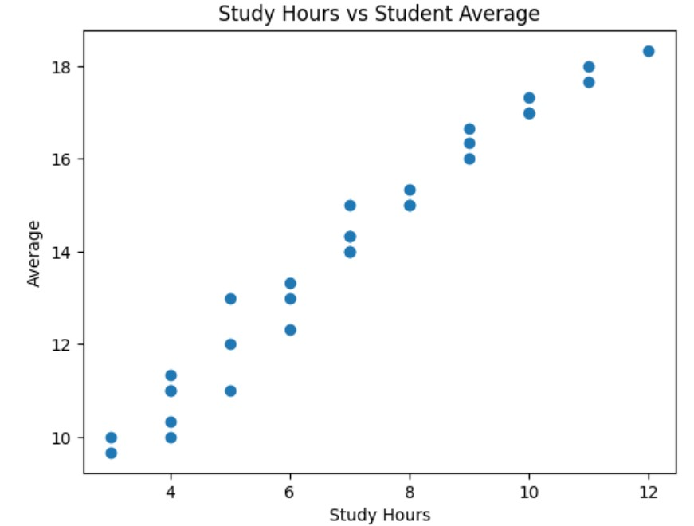
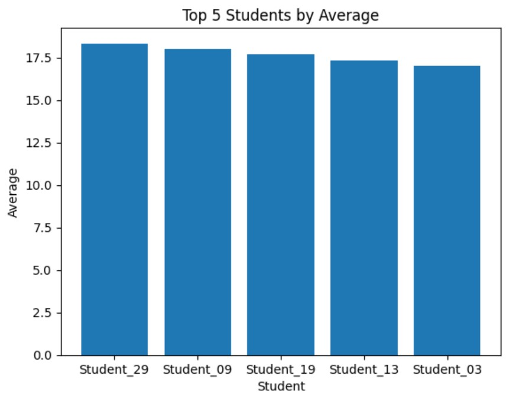

# Student Performance Analysis 📊

## Project Overview

This project analyzes student academic performance using Python and Pandas.

The goal is to explore students' grades, calculate their average scores,
identify the best-performing students, and analyze the relationship between
study hours and academic performance.

## Technologies Used

- Python
- Pandas
- Matplotlib
- GitHub

## Analysis Performed

The project includes:

- Student data analysis
- Average grade calculation
- Best student identification
- Top 5 students ranking
- Correlation analysis between study hours and average grade
- Data visualization using scatter plots
- Top 5 students visualization using bar charts

## Key Results

- Best student: Student_29
- Best average: 18.33/20
- Correlation between study hours and average: 0.98

  
## Skills Demonstrated

This project demonstrates practical skills in:

- Data manipulation with Pandas
- Basic statistical analysis
- Data visualization with Matplotlib
- Python programming
- Git and GitHub

## Results

### Study Hours vs Student Average



### Top 5 Students by Average




## Project Structure 
  ``` text
python-student-analysis/
 - README.md
 - analysis.py
 - requirements.txt
 - students.csv
 - study_hours_vs_average.png.jpg
 - top_5_students.png.jpg


 
  
